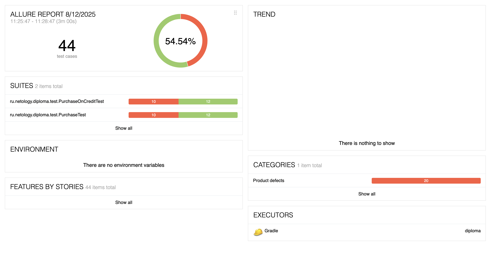
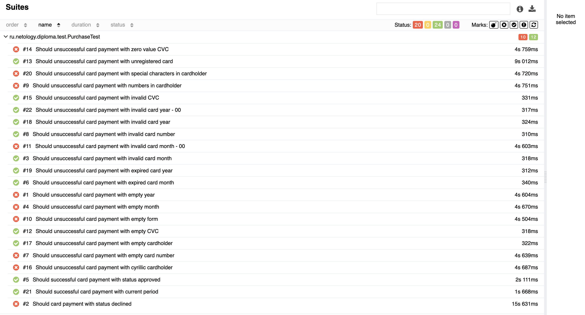
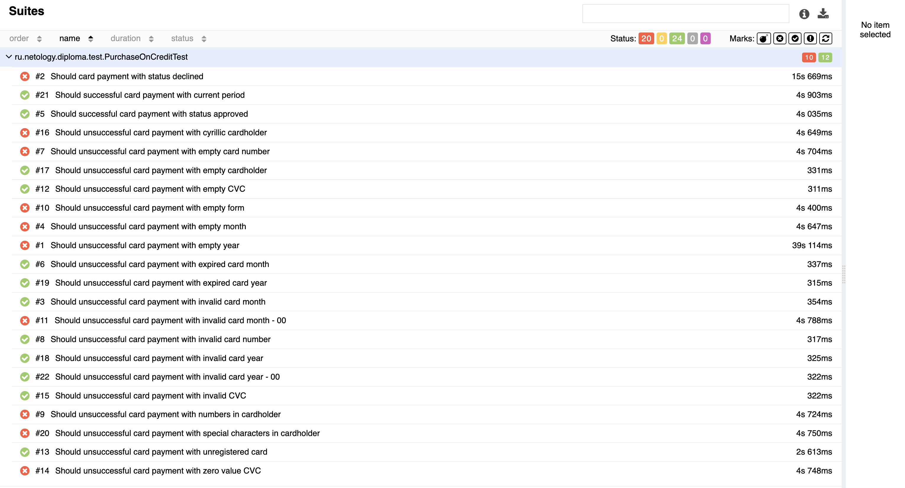

## Отчётные документы по итогам тестирования

Проведено автоматизированное тестирование веб-приложения по покупке тура. В ходе тестирования были реализованы позитивные и негативные сценарии покупки тура по двум пользовательским путям: приобретение тура по дебетовой карте и приобретения тура в кредит.

**Количество проведенных тестов:**

- запущенных тестов: 44

- успешно пройденных тестов: 24 - 54,54%

- проваленных тестов: 20 - 45,46%

**Общие результаты тестирования:**

**Результаты тестов в разрезе пользовательских путей:**

Покупка тура по дебетовой карте:

Покупка тура в кредит:

Все найденные баги оформлены в [Issues](https://github.com/SvetlanaKh-1/diploma/issues)

**Общие рекомендации:**

- поправить выявленные баги, оформленные в Issues
- более подробно описать документацию по работе приложения во избежания непонимания между специалистами, каким образом должно работать приложение: какие ответы бэка должны приходить при незарегистрированной карте, какие сообщения-ошибки должны отображаться в случае незаполненных полей и пр.
- добавить тестовые метки для облегчения работы по автоматизации тестирования
- исходя из пользовательского опыта, рекомендуется добавить исчезание сообщений-подсказок под неверно заполненными полями, если пользователь их очищает и заполняет заново, чтобы он понимал, что введенные им новые данные возможно являются корректными и будут снова проверены после клика на кнопку "Продолжить"
- плейсхолдеры года и месяца, зафиксированные на конкретном месяце и годе устаревают, вместо конкретных цифр можно использовать нечисловые значения представления дат - "ММ" и "ГГ"
- рекомендуется ввести ограничение на количество вводимых символов в поле "Владелец" для оптимизации производительности и предотвращения загрузки памяти лишними значениями, так как стандарт по количеству символов на банковской карте допускает всего 26 символов для имени и фамилии владельца карты
- рекомендуется ввести запрет на ввод недопустимых символов в поле "Владелец" для снижения вероятности SQL-инъекции или XSS-внедрения вредоносного JavaScript-кода. (Кавычки, скобки, знаки препинания и пр.)